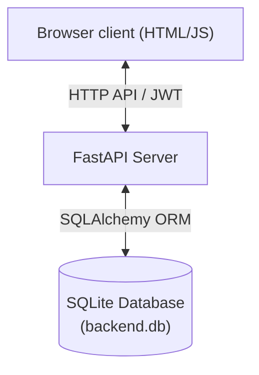
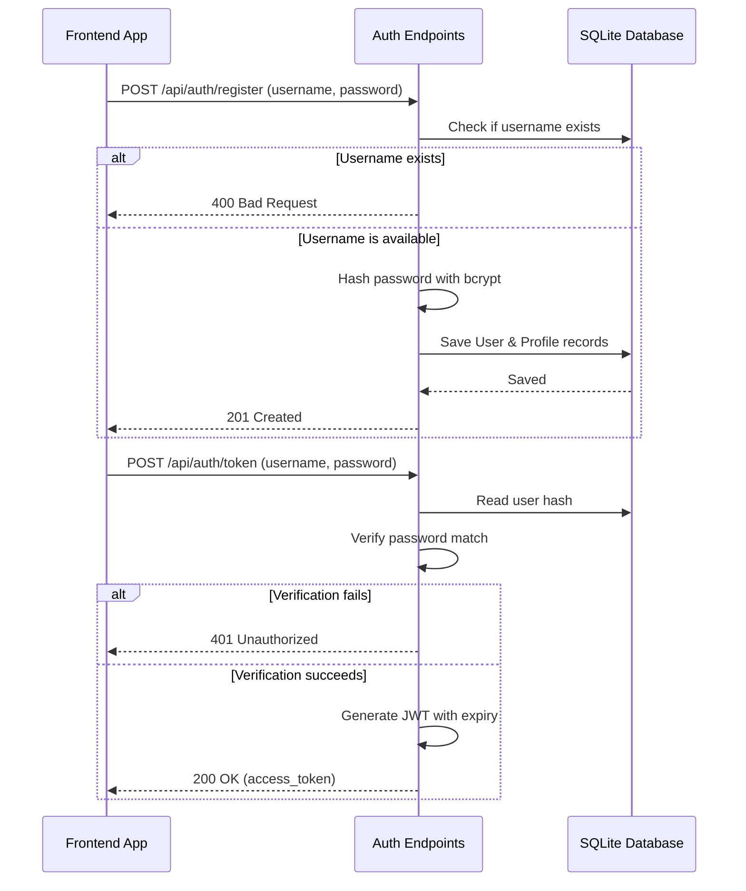
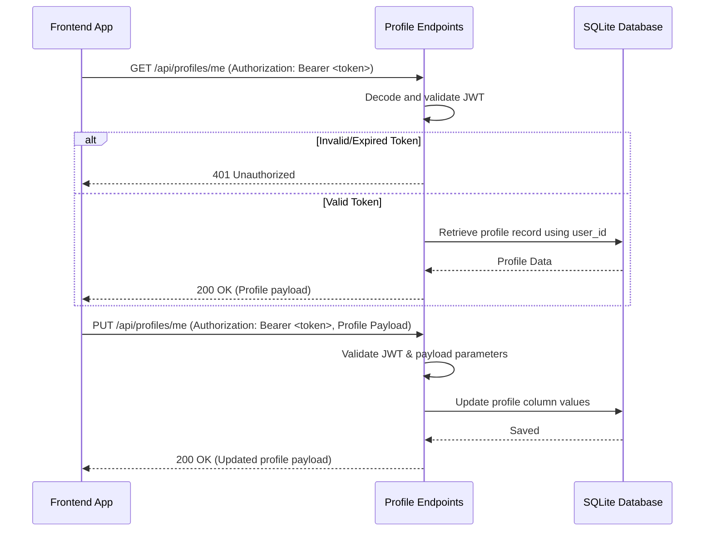

# Overview
This design document details a simple, full-stack web application that allows users to register, log in, and manage their user profiles. The application is designed to be lightweight, secure, and easy to run locally.

## Goals
* **User Authentication**: Secure user registration, login, and session management.
* **Profile Management**: Capabilities to create, view, and update dynamic user profile details (e.g., full name, bio, and avatar).
* **Simplified Tech Stack**: A unified, low-overhead setup combining a Python backend with zero external build-tooling requirements for the frontend.
* **Persistent Storage**: Utilization of a relational database schemas with robust password hashing.

## Architecture
The application uses a unified monolithic single-server architecture. The FastAPI backend serves both the transactional JSON APIs and the static frontend SPA (Single Page Application).

* **Frontend**: A clean, single-page application built on HTML5, Tailwind CSS (loaded via CDN), and vanilla JavaScript. Kept in a `/static` dir web-served directly by FastAPI.
* **Backend**: FastAPI RESTful backend running with Uvicorn, structured to handle authorization routes, profile CRUD operations, and serve static assets.
* **Database**: SQLite (SQLModel/SQLAlchemy) for zero-setup, lightweight data persistence.

## Components
### 1. Frontend Client
Composed of index files served statically:
* **Authentication Screens**: Minimal signup and login forms with real-time field validation.
* **User Dashboard & Profile Card**: A secure view featuring user-specific metadata and an editable profile configuration panel.
* **API Bridge (`app.js`)**: Coordinates fetches to the FastAPI backend, controls state, and stores authorization tokens in `localStorage`.

### 2. Backend Service ([main.py](file:///Users/epicgdog/Documents/projects/Google-IO-Hackathon-2026/backend/main.py))
* **Application Initializer**: Registers endpoints and mounts static files.
* **Authentication Router (`/api/auth`)**:
  * `POST /api/auth/register`: Create a username/password record. Passwords are securely hashed with `bcrypt`/`passlib`.
  * `POST /api/auth/token`: Performs authentication checks and returns a JWT access token.
* **Profiles Router (`/api/profiles`)**:
  * `GET /api/profiles/me`: Returns the active user's profile information.
  * `PUT /api/profiles/me`: Updates profile details.
* **Static SPA router (`/`)**: Fallback router to serve client index pages for unrecognized endpoints.

### 3. Database Layer
Managed with SQLAlchemy or SQLModel schemas:
* **Users Schema**:
  * `id`: Integer (Primary Key)
  * `username`: String (Unique, Indexed)
  * `hashed_password`: String
  * `created_at`: DateTime
* **Profiles Schema**:
  * `id`: Integer (Primary Key)
  * `user_id`: Integer (Foreign Key -> Users.id)
  * `full_name`: String (Nullable)
  * `bio`: String (Nullable)
  * `avatar_url`: String (Nullable)
  * `updated_at`: DateTime

## Data Flow
### User Registration & Authentication Flow

### Profile Retrieval & Update Flow

## Open Questions
1. **JWT Storage**: Should the frontend store access tokens in `localStorage` for visual code simplicity, or on HttpOnly, secure cookies to guard against Cross-Site Scripting (XSS) attacks?
2. **Profile Avatars**: Will simple string-based URLs (or high-quality default emoji selections) satisfy the profile picture goal, or is custom image file-uploading required?
3. **ORM Selection**: Do you prefer traditional `SQLAlchemy` schemas paired with native `Pydantic` models, or unified `SQLModel` libraries for rapid prototyping?
4. **Environment Configuration**: Should we configure database path and security keys using a `.env` loader file, or default to standard in-memory parameters for starting?