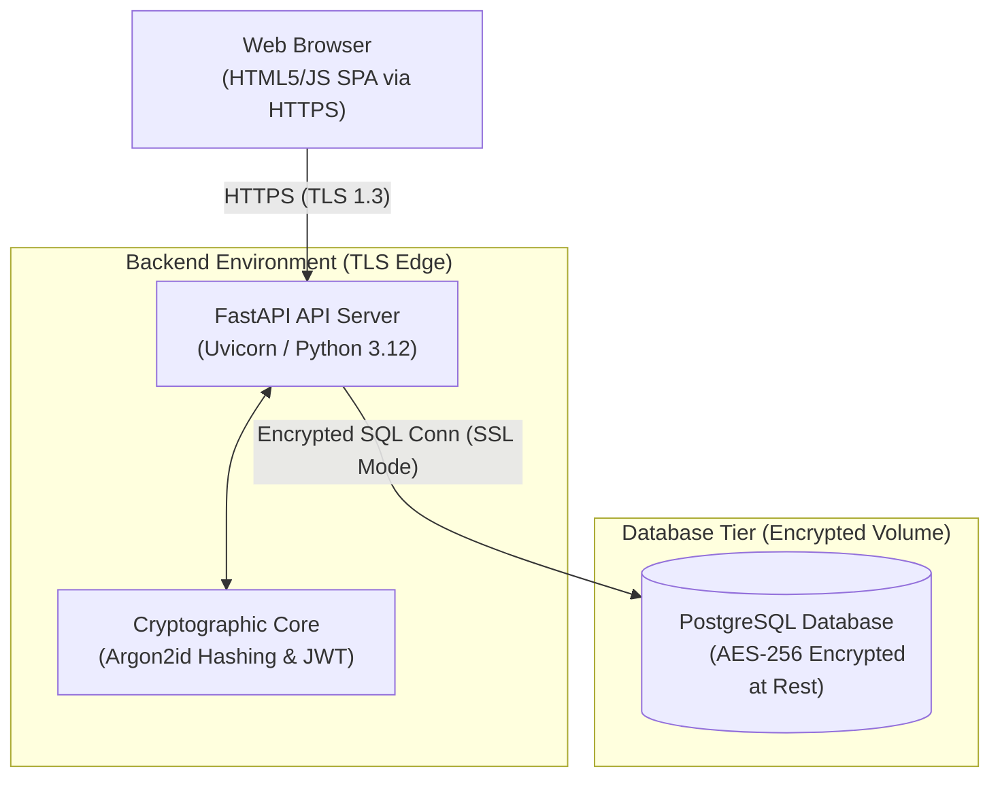
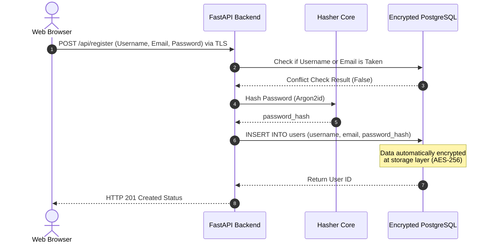
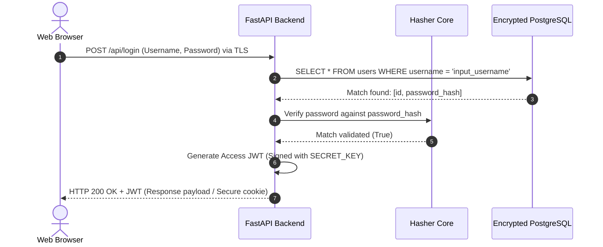

# Overview
The proposed system is a secure, lightweight web application that allows users to create accounts (register) and authenticate (log in) securely. User credentials and profile information will be persisted in a database using industry-standard encryption practices to ensure data-at-rest and data-in-transit security. 

To address the user's request for a "simple website" while adhering to cybersecurity best practices, the application will use a decoupled Client-Server architecture with a secured relational database backend.

## Goals
### Functional Goals
* **Account Creation (Registration)**: Users can register unique accounts with a username, valid email, and secure password.
* **Authentication (Login)**: Users can securely log in using their credentials to establish an active session.
* **Session Management**: Authenticated users receive a secure session token (JWT) allowing access to protected space on the site.

### Non-Functional Goals
* **Password Security**: Passwords must never be stored in plaintext. They will be hashed using a modern, computation-intensive key derivation function (Argon2id or bcrypt) with random salts.
* **Database Encryption**: The database will be encrypted at rest (AES-256) to ensure data confidentiality in the event of hardware or storage volume compromise.
* **Network Security**: All communication between the client and backend service must be encrypted in transit using TLS v1.3 (HTTPS).
* **Simplicity and Maintainability**: Keep the backend lightweight (FastAPI/Python) and the frontend straightforward (HTML5/styled-CSS/JS SPA or React) for ease of development.

## Architecture
This system utilizes a classic layered multi-tier architecture consisting of:
1. **Presentation Layer (Frontend)**: A single-page web client built with HTML5, CSS3, and JavaScript running inside the user's browser.
2. **Application Layer (API Backend)**: A modular FastAPI service acting as the backend engine. It processes requests, manages authentication logic, hashes passwords, and speaks to the persistence tier.
3. **Data Tier (Database)**: A PostgreSQL cluster with Transparent Data Encryption (TDE) or full-disk AES-256 volume encryption enabled.

## Components
### 1. Presentation Tier (Web Frontend)
* **Register Screen**: Captures Username, Email, Password, and Password Confirmation. Implements client-side length, complexity, and uniformity policies prior to submission.
* **Login Screen**: Captures Username/Email and Password. Safely handles and clears memory of input buffers.
* **Dashboard (Protected Area)**: A simple landing space displayed to authenticated users, displaying their status.
* **Client Auth Handler**: Manages the storage of temporary JWTs within secure memory (or HttpOnly, SameSite Session Cookies) to safeguard sessions against Cross-Site Scripting (XSS).

### 2. Application Tier (FastAPI Backend)
* **Registration Controller**: Endpoint `POST /api/register` processes incoming sign-ups. Rejects weak passwords and handles username-uniqueness validation.
* **Login Controller**: Endpoint `POST /api/login` verifies user-submitted credentials and issues an ephemeral JSON Web Token (JWT).
* **Cryptographic Core**:
  * **Hasher Component**: Leverages the `argon2-cffi` or `bcrypt` library to process incoming plaintext passwords with randomly generated salts.
  * **Token Generator**: Generates cryptographically signed JWT tokens with a localized expiration period (e.g., 30 minutes). Uses an HMAC with SHA-256 signature using a secure key from backend environment variables.
* **Database Access Abstraction**: SQL Alchemy or SQLModel connection engine configured to use strict SSL connection parameters for querying PostgreSQL.

### 3. Storage Tier (Database)
* **Database Choice**: PostgreSQL or SQLite with SQLCipher extension (for localized/offline setups).
* **Database Security**: Complete disk volume encryption (AES-256) or Postgres Transparent Data Encryption (TDE).
* **Users Schema Table (`users`)**:
  | Column Name | Data Type | Constraints | Description |
  | :--- | :--- | :--- | :--- |
  | `id` | `UUID` | PRIMARY KEY, Default: uuid_generate_v4() | Unique internal identifier. |
  | `username` | `VARCHAR(50)` | UNIQUE, NOT NULL | Publicly visible registration name. |
  | `email` | `VARCHAR(255)` | UNIQUE, NOT NULL | User's unique email. |
  | `password_hash` | `VARCHAR(255)` | NOT NULL | Salted Argon2id or bcrypt hash of the password. |
  | `created_at` | `TIMESTAMP` | NOT NULL, Default: NOW() | Audit timestamp metadata. |
  | `last_login` | `TIMESTAMP` | NULL | Monitoring access metrics. |

## Data Flow
### A. User Registration Flow
1. **Input Submission**: The user enters their information and clicks "Sign Up".
2. **Payload Transmission**: The client app validates metrics and sends a `POST /api/register` request containing JSON payloads (plain password) over a secure HTTPS/TLS tunnel.
3. **Existence Check**: The API backend queries the database for whether the `username` or `email` already exists to prevent duplicate credentials.
4. **Password Hashing**: If unique, the Cryptographic Core generates a secure salt and passes the password through the Argon2id key derivation function to generate a secure `password_hash`.
5. **Data Persistence**: The backend issues an `INSERT` statement to the DB, appending the username, email, and hashed credentials into the encrypted storage volume.
6. **Response**: A `201 Created` status is returned to the client, notifying them to redirect to the login page.

### B. User Authentication Flow
1. **Input Submission**: The user enters their Username/Email and password on the Login form.
2. **Credential Transmission**: Submitted passwords flow over HTTPS to the backend controller `POST /api/login`.
3. **Lookup**: The backend retrieves the matching record from the `users` table based on the identifier provided.
4. **Verification**: The retrieved `password_hash` and the newly submitted plaintext password are fed into the Cryptographic verification function.
5. **Token Generation**: If the passwords match, the backend generates an access JWT signed with the backend's `JWT_SECRET` key.
6. **Authorization Response**: The token is sent back to the client as an Authorization payload (or stored in an HttpOnly cookie) for subsequent API requests.

## Open Questions
* **Level of Database Encryption**: Does "encrypted database" mean encryption-at-rest (the underlying server disk storage volume is encrypted with AES-256 via the infrastructure/cloud provider)? Or is client-side/application-layer column or envelope encryption required (where sensitive credentials are additionally encrypted before we invoke SQL queries)?
* **Session Strategy**: Should sessions be managed via JSON Web Tokens (JWT) kept in browser session storage, or should they use more secure Stateful HttpOnly Cookies with the `SameSite=Strict` flag to mitigate Cross-Site Scripting (XSS)?
* **Requirements for Password Reset**: Is a password recovery flow required (e.g., SMTP integrations to send reset tokens, or security questions), or is self-service password recovery out of scope for the MVP?
* **Hosting Environment**: Is this simple website meant to serve locally on a developer’s machine (e.g., using Docker Compose with SQLite/Postgres), or is there a specific cloud destination targets (e.g., AWS RDS with KMS encryption, Google Cloud SQL with customer-managed keys)?