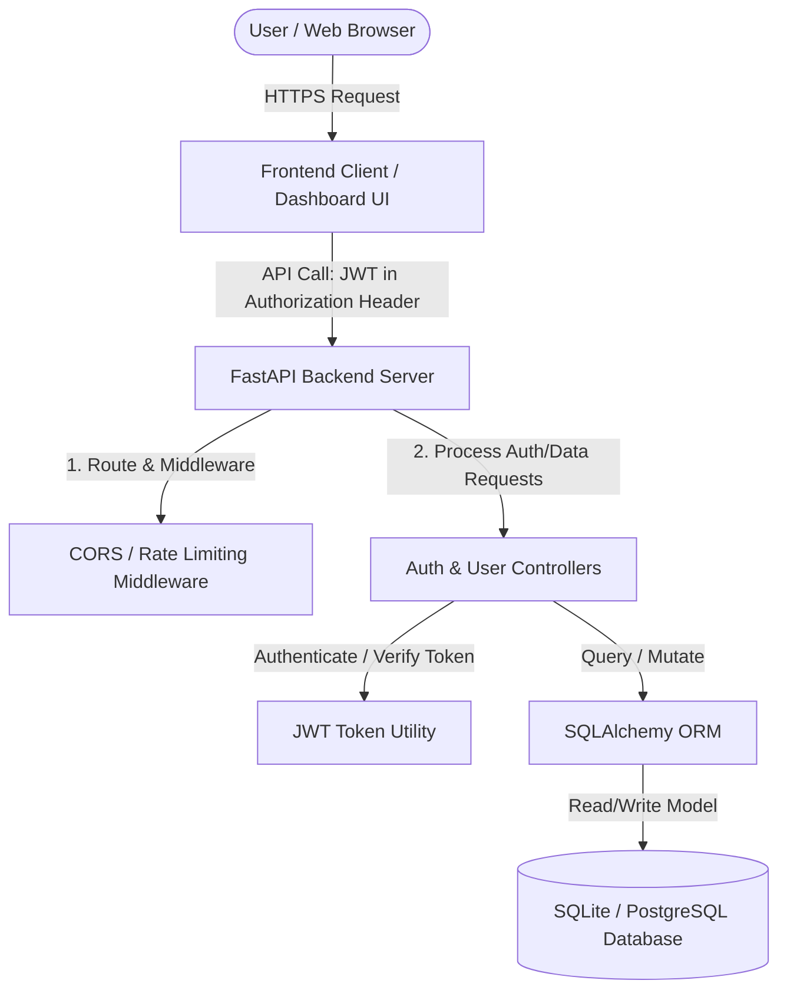
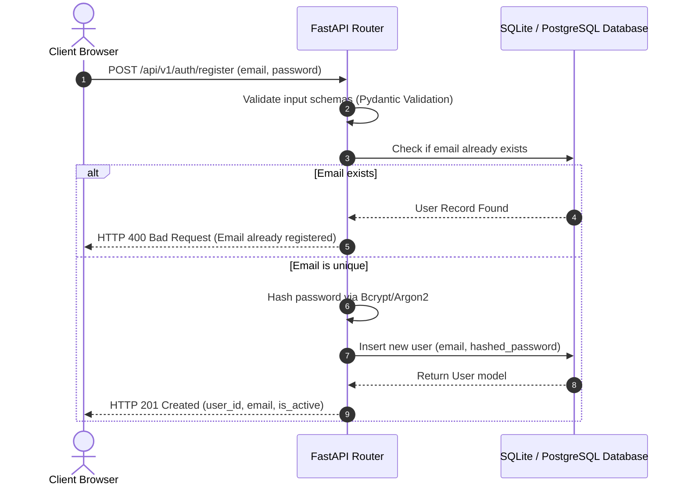
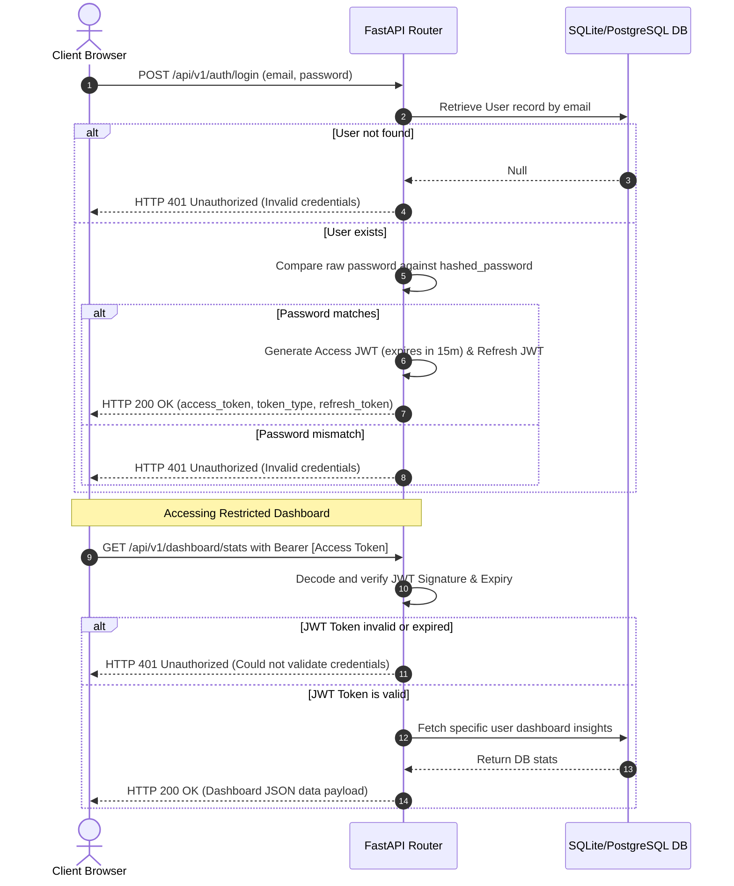

# Overview
The system enables users to safely register and log in to a web-based dashboard application. It provides a secure, lightweight, and scalable authentication backend using FastAPI, SQLite/PostgreSQL, and JSON Web Tokens (JWT). The infrastructure is designed to be fully modular, allowing for independent scaling of authentication and dashboard services.

## Goals
- **Secure User Registration:** Allow new users to create accounts with email and password, ensuring password hashing using Argon2/bcrypt.
- **Stateless Authentication:** Verify user identity via secure, short-lived JWT access tokens and longer-lived, HttpOnly refresh tokens.
- **Dashboard Access Control:** Restrict dashboard endpoints to authenticated or authorized users only.
- **Concrete Technical Defaults:** Use FastAPI, SQLite (for development) transitioning to PostgreSQL, and SQLAlchemy ORM for database representation.
- **Developer-Friendly API Documentation:** Automatically expose interactive Swagger UI and ReDoc endpoints.

## Architecture
The system adopts an API-first monolithic architectural style (highly modular) designed for fast, modern deployments:
1. **Frontend Client:** Web dashboard (React/Vue/HTML5) that interacts with APIs via secure HTTPS.
2. **API Gateway / Router (FastAPI):** Orchestrates routing, middleware (CORS, Rate Limiting), and dependency injection.
3. **Authentication Layer:** Deals with credentials verification, password hashing, and token signing/validation.
4. **Data Access Layer:** Uses SQLAlchemy ORM to communicate with the SQLite/PostgreSQL Database.
5. **Database Layer:** Holds the relational data model for users, sessions, and dashboard resources.

## Components
The infrastructure comprises the following Core Components:

1. **User Manager & AuthService:**
   - **Responsibility:** Password hashing (using `passlib` with `bcrypt` backend), access/refresh token generation, and user validation logic.
   - **Core API endpoints:**
     - `POST /api/v1/auth/register` (Payload: `UserCreate` schema)
     - `POST /api/v1/auth/login` (Payload: `OAuth2PasswordRequestForm`)
     - `POST /api/v1/auth/refresh` (Payload: Refresh token)

2. **Dashboard Controller & User Routes:**
   - **Responsibility:** Fetching user-specific dashboard insights and editing profile settings.
   - **Core API endpoints:**
     - `GET /api/v1/users/me` (Protected: Requires valid Bearer Token)
     - `GET /api/v1/dashboard/stats` (Protected: Dashboard data tailored to the logged-in user)

3. **Database Model (`User` Entity):**
   - **Columns:**
     - `id`: `UUID` (Primary Key, uniquely identifies the user)
     - `email`: `String(255)` (Unique, Indexed, used as login identifier)
     - `hashed_password`: `String` (Securely encrypted password hash)
     - `is_active`: `Boolean` (Flags deactivated accounts)
     - `created_at`: `DateTime` (Timestamp of creation)
     - `updated_at`: `DateTime` (Timestamp of last update)

4. **Dependency Injection & Security Rules:**
   - `get_db`: Yields database sessions.
   - `get_current_user`: Dependency that extracts, decodes, and validates the JWT Bearer-Token, fetching the user dynamically.

## Data Flow

### User Registration Flow

### User Login & Dashboard Access Flow
